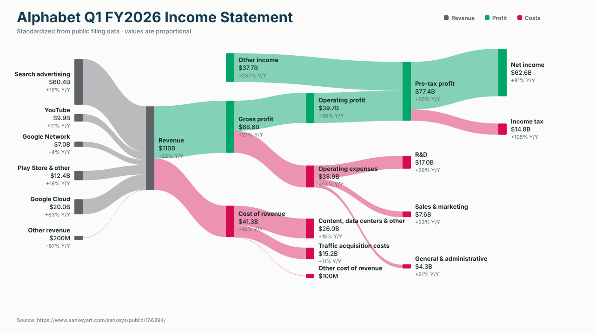

# Earnings Sankey

Turn public SEC earnings data into clear, consistent income-statement Sankey diagrams.



The hosted app is available at
[earnings.sandeepgangarapu.com](https://earnings.sandeepgangarapu.com). It may
take a few seconds to start after a period without traffic.

The project fetches structured Company Facts from SEC EDGAR, selects the correct filing duration, maps company-specific US-GAAP concepts into a common schema, reconciles the accounting flows, and produces a polished SVG/HTML chart. It includes a local web app, CLI, editable JSON output, and an offline example.

## What works today

- U.S. public-company tickers with structured 10-Q or 10-K Company Facts
- Q1, Q2, Q3, and full-year periods
- Automatic normalization of revenue, cost of revenue, gross profit, operating expenses, operating profit, other income/expense, pretax profit, tax, and net income
- Automatic R&D, sales/marketing, G&A, or SG&A breakout when non-overlapping SEC facts are available
- Same-period year-over-year changes
- Chart, SVG-source, and normalized-JSON views with pasteable PNG images and explicit downloads
- Native sharing plus ready-to-open LinkedIn, X, and Facebook share links
- Manual JSON overrides for business-segment revenue and company-specific cost detail
- Positive-profit and basic loss-making statement layouts

The renderer is dependency-free: it generates responsive SVG directly rather than relying on a charting service or JavaScript visualization library.

## Run the web app

Python 3.10+ and [`uv`](https://docs.astral.sh/uv/) are the only requirements.

```bash
uv sync
uv run earnings-sankey-server --open
```

Then open `http://127.0.0.1:8000`. Select **View example** to try the bundled chart without a network request.

For live SEC data, enter an SEC identity such as `Your Name you@example.com`. SEC asks automated clients to declare a name/company and contact email. The local app sends it only in the request header to SEC.gov and does not persist or log it.

## Use the CLI

```bash
export SEC_USER_AGENT="Your Name you@example.com"

# Latest usable filing period
uv run earnings-sankey AAPL

# Specific period with all export formats
uv run earnings-sankey GOOGL \
  --fiscal-year 2025 \
  --period Q2 \
  --output output/googl-q2.html \
  --svg-output output/googl-q2.svg \
  --json-output output/googl-q2.json

# Offline visual reference
uv run earnings-sankey --sample --output output/example.html
```

## Add business-segment detail

SEC Company Facts reliably exposes consolidated financial-statement facts, but product and geographic segment dimensions vary by company. Use an override file to add curated breakdowns from a public earnings release while retaining the normalized totals:

```json
{
  "revenue_streams": [
    {"name": "Products", "value": 70000000000, "yoy_percent": 8.2},
    {"name": "Services", "value": 30000000000, "yoy_percent": 14.1}
  ],
  "cost_of_revenue_items": [
    {"name": "Product costs", "value": 35000000000},
    {"name": "Service costs", "value": 10000000000}
  ]
}
```

```bash
uv run earnings-sankey AAPL --override segments.json
```

The renderer adds an “Other” residual when provided items do not equal the normalized total. If items exceed the total materially, it falls back to the consolidated node rather than drawing a misleading chart.

## Normalization pipeline

1. Resolve the ticker against the SEC ticker/CIK index.
2. Fetch the entity's SEC Company Facts JSON.
3. Filter facts by fiscal year, fiscal period, filing form, and duration. This avoids accidentally using six- or nine-month year-to-date values for Q2 or Q3.
4. Map common US-GAAP concept variants into a canonical income statement.
5. Reconcile linked stages with accounting identities such as `revenue − gross profit = cost of revenue` and `pretax income − net income = tax`.
6. Prefer non-overlapping operating-expense details; add an “Other operating expenses” residual as needed.
7. Repeat normalization for the prior fiscal year to calculate comparable year-over-year changes.
8. Build a semantic graph and render neutral revenue flows, green profit flows, and pink cost flows.

Every live chart retains the filing date, accession number, normalization notes, and a link to the SEC filing directory.

## Project structure

```text
src/earnings_sankey/
  sec.py          SEC API client and ticker resolution
  normalize.py    XBRL selection and canonical accounting model
  graph.py        Semantic Sankey graph construction
  render.py       Dependency-free SVG and HTML renderer
  server.py       Local web app and JSON API
  cli.py          Command-line exports
web/              Browser UI
examples/         Editable bundled statement data
tests/            Unit and render tests
```

## Test

```bash
uv run python -m unittest discover -s tests -v
node --test tests/test_result_actions.mjs tests/test_app_controller.mjs
```

GitHub Actions runs the Python and browser-controller unit suites plus an offline HTML/SVG smoke test on every push and pull request.

## Deployment

The public app runs from the container defined in `Dockerfile` using the Fly.io
settings in `fly.toml`. The single Machine stops when idle, starts on the next
request, and exposes a lightweight health check at `/healthz`.

Successful `main` push test runs trigger `.github/workflows/fly-deploy.yml`.
That workflow requires a deploy-scoped `FLY_API_TOKEN` repository secret; the
token itself must never be committed.

## Data and design notes

The source data comes from the SEC's official [EDGAR APIs](https://www.sec.gov/search-filings/edgar-application-programming-interfaces). Automated use should follow the SEC's [fair-access guidance](https://www.sec.gov/about/developer-resources), including the published request-rate ceiling and declared user agent.

The visual treatment is inspired by the linked [SankeyArt Alphabet income-statement example](https://www.sankeyart.com/sankeys/public/166394/) and its published principles: consistent semantic colors, nearby related nodes, clear whitespace, smooth continuity, and limited visual clutter. The renderer and implementation in this repository are original.

Company Facts are derived from issuer filings and can contain extensions, restatements, unusual fiscal calendars, and issuer-specific presentation choices. The tool surfaces inference notes, but it is not a substitute for reviewing the full filing and is not investment advice.
